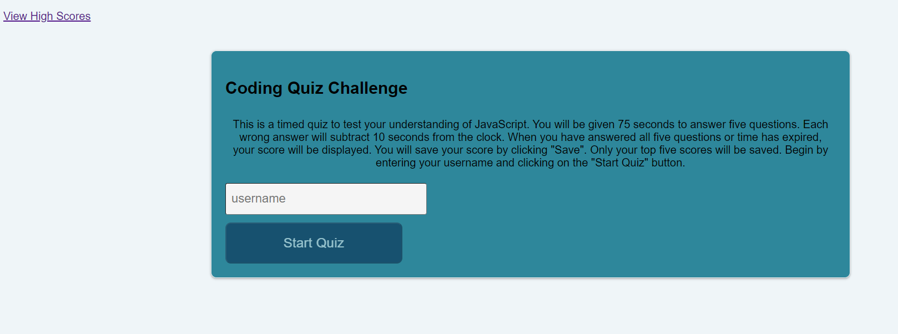
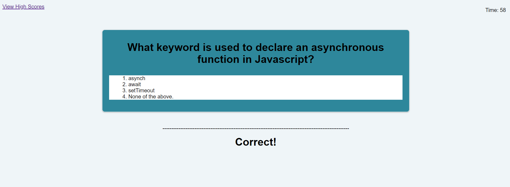
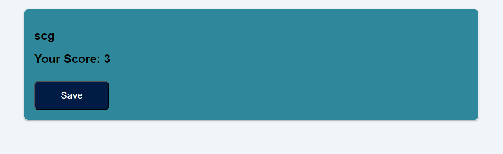
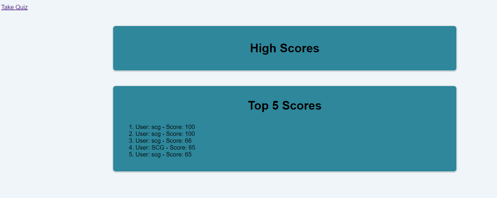

# Module-4-Challenge-Repository
This is the repository for the module 4 challenge.
## Description
This is the coding quiz application. When the user invokes the application, the landing page explains the application and prompts the user to enter their username. After they enter their username, the "Start Button" is enabled. Clicking "Start" sets the countdown timer to 75 seconds and displays the first question for the quiz. The user then clicks on their chosen answer. If correct, a green "correct" message is displayed and the next question is displayed. If the answer is incorrect, a red "incorrect" is displayed, 10 points is deducted from the timer and the next question is displayed. The quiz ends when either all five questions have been answered or the timer has run down to 0. At this point, the application displays their score with a "Save" button. Clicking "Save" appends the score to the high scores list. The list is always pruned so that only the top five scores are displayed. After clicking "Save", the top five scores and usernames are displayed.

## Usage

https://pure-meadow-97781-b0eaed2fac42.herokuapp.com/

## Github Repository
https://github.com/SparkKids/Module-11-Challenge-Repository/tree/main

## Screenshot:

## Contributing

11/25/2023 Steven Gray - Original Code Written

## License

MIT License

Copyright (c) 2023 SparkKids
